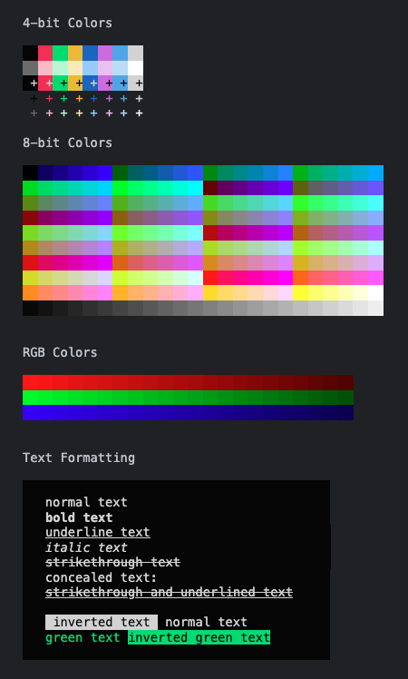

# ANSI Escape Sequences Polyfill for Browser Developer Consoles

[ANSI escape sequences](https://en.wikipedia.org/wiki/ANSI_escape_code#SGR) are supported in the [Chrome developer console](https://developer.chrome.com/docs/devtools/console/format-style/#style-ansi) for styling console logs, but not yet in other browsers.

They can be useful to bridge the gap between browser and backend JavaScript, since the same styled logs can be used in terminals and in the browser console.

This polyfill implementation closely follows the Chrome implementation, but has additional support for background-foreground color inversion, 8 bit colors, images (following the [iTerm2 Inline Images Protocol](https://iterm2.com/documentation-images.html)), and more.



## Usage

The module can be imported from <https://cdn.jsdelivr.net/gh/unyt-org/ansi-browser-dev-console-polyfill/dist/main.min.js>.

You can use the `console` object exported from this module in place of the normal `globalThis.console`.

```typescript
import {console} from "https://cdn.jsdelivr.net/gh/unyt-org/ansi-browser-dev-console-polyfill/dist/main.min.js";

console.log('\x1b[32mGreen text')
console.warn('\x1b[31mRed text')
```

There are also two methods for adding ANSI support to the global console:
 * `enableFullSupport` enables the polyfill ANSI parser in every browser (including Chrome)
 * `enableMinimal` enables the polyfill only in browsers that don't support ANSI escape sequences. Note that in this case, Chrome browsers will not support the extended ANSI features implemented in this polyfill.

Enabling the polyfill will not have any effects in backend runtimes like deno.

```typescript
import {enableFullSupport} from "https://cdn.jsdelivr.net/gh/unyt-org/ansi-browser-dev-console-polyfill/dist/main.min.js";
enableFullSupport();
// ANSI escape sequences are now supported in the global console!
console.log('\x1b[32mGreen text'); 
```

## Supported Escape Sequences

## SGR Parameters

| Escape Sequence | Effect |
 ---------------- | ------ |
|`\x1B[m`         | Reset all styles |
|`\x1B[0m`         | Reset all styles |
|`\x1B[1m`         | Bold text |
|`\x1B[3m`         | Italic text |
|`\x1B[4m`         | Underline |
|`\x1B[5m`         | Bold text |
|`\x1B[7m`         | Invert foreground and background |
|`\x1B[8m`         | Hide text |
|`\x1B[9m`         | Strike-through |
|`\x1B[21m`        | Reset bold text |
|`\x1B[23m`        | Reset italic text |
|`\x1B[24m`        | Reset underline |
|`\x1B[25m`        | Reset bold text |
|`\x1B[27m`        | Reset foreground-background inversion |
|`\x1B[29m`        | Reset strike-through |
|`\x1B[53m`        | Overline |
|`\x1B[55m`        | Reset overline |
| | |
|`\x1B[3xm`        | Set foreground color |
|`\x1B[9xm`        | Set foreground color (light colors) |
|`\x1B[4xm`        | Set background color |
|`\x1B[10xm`       | Set background color (light colors) |
|`\x1B[38;2;r;g;bm` | Set RGB foreground color |
|`\x1B[38;2;r;g;bm` | Set RGB background color |
|`\x1B[38;5;r;g;bm` | Set [8-Bit](https://en.wikipedia.org/wiki/ANSI_escape_code#8-bit) foreground color |
|`\x1B[48;5;r;g;bm` | Set [8-Bit](https://en.wikipedia.org/wiki/ANSI_escape_code#8-bit) background color |

Combinations of parameters are also supported (e.g. `\x1B[33;44mYellow text on blue background`)

## Images

This polyfill also has support for displaying base64-encoded images, following the [iTerm2 Inline Images Protocol](https://iterm2.com/documentation-images.html):

`\x1b[1337;File=;PARAMS:IMAGE_BASE64\x07`

The `PARAMS` are key-value pairs in the format `key=value`, separated by semicolons.

The image has to be converted to a Base64 string.
Examples can be found in `examples.ts`.

### Supported parameters

The following paramters are (experimentally) supported:

 * width in px (e.g. `width=200px`)
 * height in px (e.g. `height=200px`)
 * preserveAspectRatio (default is `1`, can be set to `preserveAspectRatio=0`)

Other parameters are ignored.

### Supported image formats

 * svg
 * png
 * jpg
 * gif


### Issues

Images are not correctly displayed in Safari browsers.